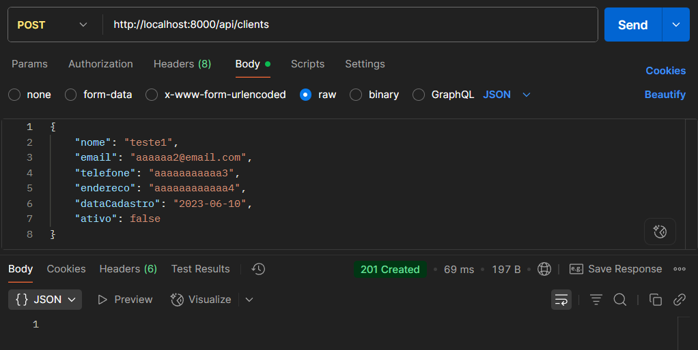
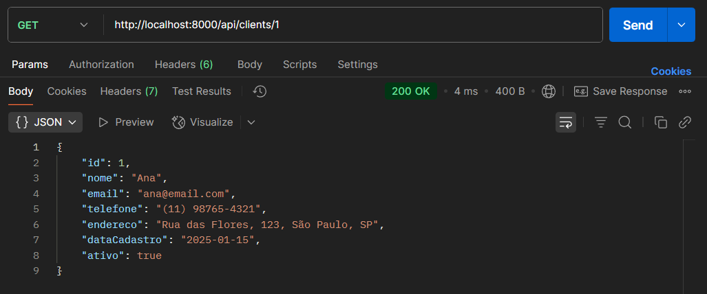
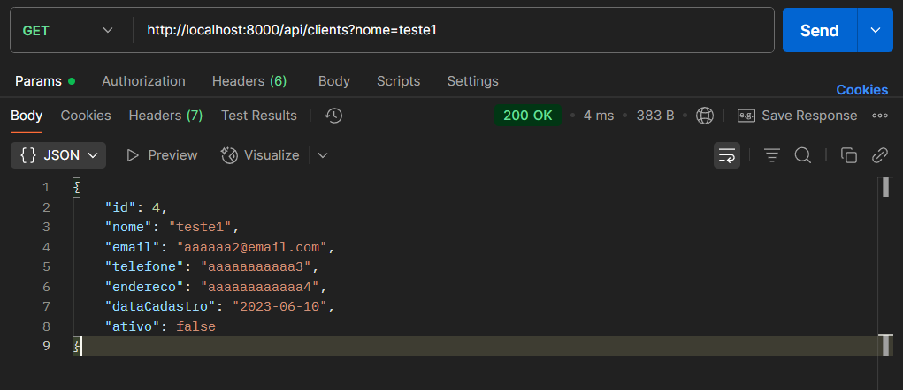
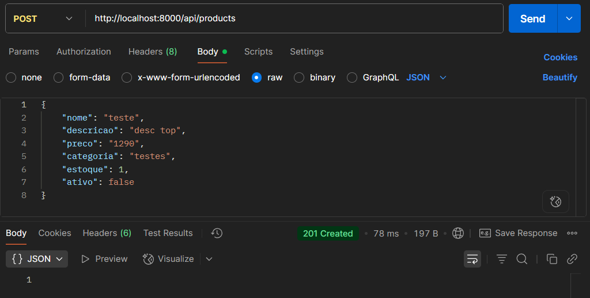
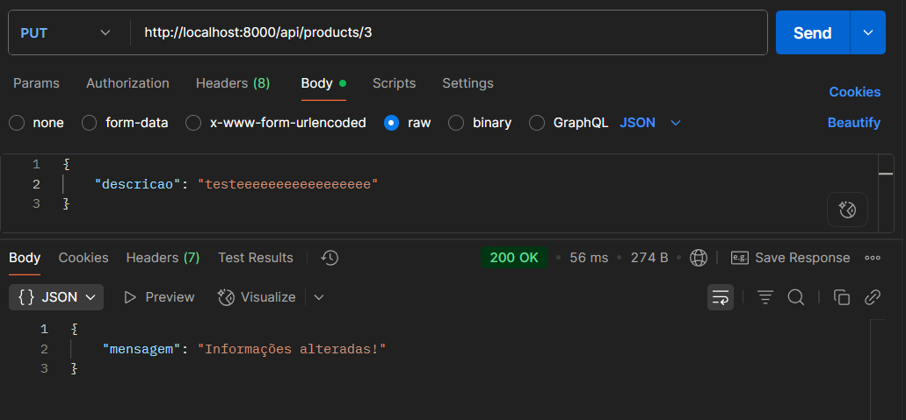
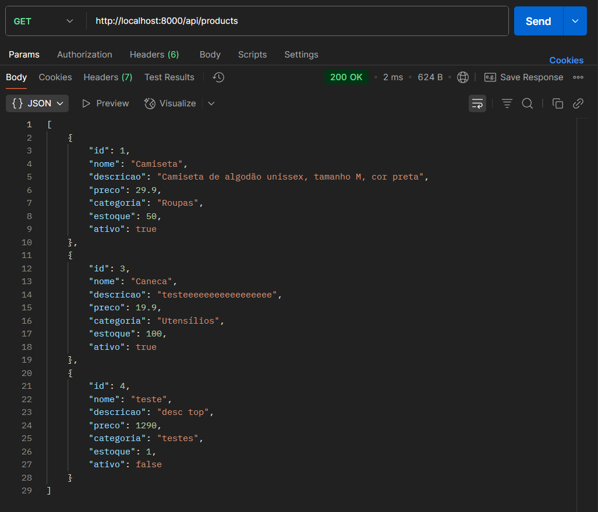
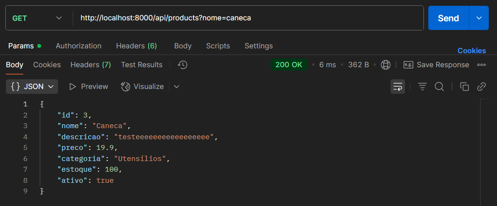

# API Produtos e Clientes


## Navegação
- [Sobre o Projeto](#sobre-o-projeto)
- [Tecnologias Utilizadas](#tecnologias-utilizadas)
- [Estrutura do Projeto](#estrutura-do-projeto)
- [Executando o Projeto](#executando-o-projeto)
- [API Endpoints](#api-endpoints)
- [Autor](#autor)

## Sobre o Projeto
Este projeto é uma API backend desenvolvida como atividade durante as aulas da matéria de Backend com Node.js do SENAI. A API gerencia produtos e clientes, permitindo operações de criação, exclusão, atualização, listagem total e obtenção de dados individuais tanto por id quanto por nome.

## Tecnologias Utilizadas
- **Node.js**
- **Express**
- **Postman**

## Estrutura do Projeto
O código do projeto está localizado dentro da pasta `src`, onde está organizado em arquivos `model`, `controller` e `routes`.
- Os arquivos **model** guardam os dados das entidades que eles representam (pois os dados estão armazenados em arrays em memória), além de possuírem as funções que irão interagir com os dados armazenados.
- Os arquivos **controller** são responsáveis por fazerem as validações das requisições para a API, retornando o resultado esperado, ou mensagem de erro.
- Os arquivos **routes** definem as rotas e para qual método HTTP cada uma delas será utilizada.

## Executando o Projeto

### Pré-requisitos
- **Node.js**
- **NPM** (gerenciador de pacotes do Node.js)
- **Postman** (ou outra ferramenta para testes de API)

### Passos
1. Clone esse repositório:
```bash
git clone https://github.com/zNathan2303/backend-atividade-senai_api-produtos
```
2. No terminal, rode na raiz do projeto:
```bash
npm install
```
3. Após instalar as dependências do projeto, rode no terminal:
```bash
node server.js
```
4. Abra o Postman e teste os endpoints.

## API Endpoints
Abaixo está a utilização prática dos endpoints no Postman:

### Endpoints Client
**Criando um cliente:**


**Atualizando o nome do cliente que possui ID igual a 3:**


**Excluindo um cliente por ID:**


**Obtendo todos os clientes:**


**Obtendo um cliente que tem ID igual a 1:**


**Obtendo cliente que tem nome igual ao parâmetro passado na url:**


### Endpoint Product
**Criando um produto:**


**Atualizando o nome de um produto que possui ID igual a 3:**


**Excluindo um produto por ID:**


**Obtendo todos os produtos:**


**Obtendo um produto que tem ID igual a 4:**


**Obtendo produto que tem nome igual ao parâmetro passado na url:**


## Autor
[Nathan da Silva Costa](<https://www.linkedin.com/in/nathandasilvacosta/>)